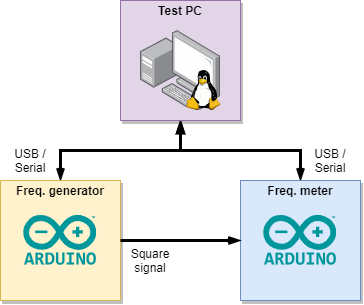

=============================================
Pyrouet is for PYthon RObUst Embedded Testing
=============================================

:Authors:  - Florian Dupeyron <florian.dupeyron@mugcat.fr>
           - François Beaulier <francois@hyvibe.audio>

.. ROLES
.. role:: p(code)
   :language: python

Purpose
=======

*Pyrouet* enables easy design of benches for embedded software and hardware testing and
developpment. It may find usages in CI/CD processes as well as SMT factory tests for electronic products,
integrating more and more software complexity. *Pyrouet*'s early closed-source versions
have been used to test H1 products from HyVibe_, from the PCB flashing and testing after SMT assembly,
to the last functional validation tests, when integrated in a HyVibe Guitar.

.. _HyVibe: https://hyvibe.audio

**Important notice**: This tool is primarly designed to work with **linux based systems**.

Philosophy and status
=====================

.. Note that the below commentary should disappear when the software will be mature enough! :D

*Pyrouet* code is still quite fuzzy. The first milestones of this public version will be to refactor and standardize the code.
**Please do not consider this toolkit stable yet**, as important structural parts may change, leading to major
break and incompatbility issues between versions.

The philosophy used in the development of this software is:

- **Tools first**: This project aims to build a set of tools, instead of having a big chunk of a rock solid software
  architecture that hasn't any kind of flexibility, and cannot foresee all use cases. Each bit should be able to be integrated
  in your very own environment and solutions. This may lead sometimes to "glue code" to interface things together. Think of it
  as similar to *numpy*: it does all kind of stuff, but you may need only some part of it.

- **Minimal dependencies**: This project tries to depend only on mainstream, well maintened projects.

- **Reliability over features**: As this toolkit targets Factories to test PCBs, there is a need of reliability to ensure fast
  tests execution and good reporting. KISS and first principles thinking rules here.

- **Automation friendly**: The ultimate goal of this project is to build fully automatic test benches, that can easily be interfaced
  with some UI monitoring.

The quick tutorial
==================

Here we will present a typical use case of the toolkit by applying it to a real-life situation.

The situation
-------------

Let's take a simple example that you may be able to reproduce easily at home. Let's consider two
devices :

- A first arduino acts as a *frequency generator* ;
- A second arduino receives the generated signal, and *measures its frequency*.

Both devices communicates using the USB/Serial port.

    Our simple test bench

Starting here, we will show how *Pyrouet* can be used in all phases of this little project.

.. Faire les sources arduino des deux machins et les rendre dispo

The project structure
---------------------

.. code::

    <project root>         
    ├── config/            │ Contains config. variables
    │   ├── global.toml    │    -> Global tool config (dev. path, etc.)
    │   └── vars.toml      │    -> Scenarii configurations
    │                      │
    ├── com/               │ Contains user defined com. interfaces
    │   └── myboard.py     │
    │                      │
    ├── tests/             │ Contains scenarii/procedures/steps related information
    │   ├── objects/       │    -> Custom python objects (for report implementation)
    │   ├── scenarii/      │    -> Scenarii files
    │   ├── steps/         │    -> Step classes
    │   └── procedures/    │    -> Procedures
    │                      │
    ├── results/           │ Contains test reports files
    ├── bench.py           │ Dev. bench script
    └── runner.py          │ Executes tests scenarii

Building the development bench
------------------------------

.. Dire que pour faire un banc de test, il y a généralement l'ensemble des interfaces de communication
   qui se branchent sur le chef d'orchestre qui exécute ensuite les scenarii de test. Introduire les
   com_interfaces, et le Procedure_Context.

The first step we will to is to build a small development bench that gives us access to a ipython_ console
to have a CLI to interact with the hardware.

.. _ipython: https://ipython.org/

In fact, usually when building our testing bench, we will distinguish between:

- The various devices we want to interact with. This can be the DUT [#]_ itself, or various test
  equipements (power supplies, frequency generators, *etc.*). In our case, we have two devices,
  a *frequency generator* and a *frequency meter*. In *Pyrouet* terminology, it is referred as
  **TODO[1]**.

- The various tests we want to execute on this **TODO[1]**. These tests are executed by an **Orchestrator**,
  in our case the *Test PC*.

The first step is then to build the various *interface classes* that will give us pythonic superpowers to access
the test devices.

These devices are serial-port based. *Pyrouet* offers the :p:`com.serial.Serial_Device` class to easily implement
Thread-ready interfaces to serial based devices.

Please keep in mind this quite annoying but necessary fact: all interfaces must be **non blocking**, to allow correct
monitoring of our tests. This may imply some trickery code to correctly and reliably implement our
communication model, and this is why **Pyrouet** have classes [#]_ for the most common communication transport layers.

.. [#] Device Under Test
.. [#] Not yet, but tends to!

Using this class we can create two files implementing our interfaces:

**com/freq_generator.py**:

.. code:: python
    :number-lines:

    from nuggett.com.serial import (Serial_Device)
    from serial             import ...

    class Frequency_Generator_Device:
        def __init__(self, dev_path):
            self.dev = ...
        
        def ping(self):
            ...

        def 
            

    

Creating and executing our first steps
--------------------------------------

Grouping steps in a procedure
-----------------------------

Building test *scenarii*
------------------------

Creating a Runner for our *scenarii*
------------------------------------
